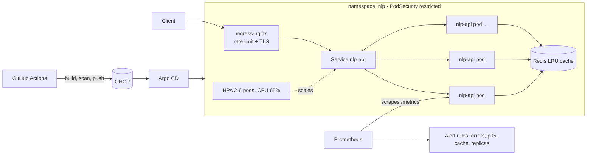

# nlp-k8s-platform


A production-style **NLP inference platform on Kubernetes**: a FastAPI service serving a
Hugging Face sentiment model, cached by Redis, deployed with Kustomize overlays, hardened
with zero-trust networking, autoscaled, observable with Prometheus, delivered by GitHub
Actions and (optionally) GitOps via Argo CD.

> Built to show the *operational* side of ML: not just "a model in a container", but
> rollouts, autoscaling, security, SLO alerts and CI that actually boots a cluster.

## Architecture



## What makes it more than a basic deployment

| Area | What's implemented |
|---|---|
| **App** | Async FastAPI, batched inference off the event loop, concurrency semaphore, SHA-256 keyed Redis cache that degrades gracefully if Redis is down, Prometheus metrics |
| **Image** | Multi-stage, non-root (uid 10001), model weights **baked in** (no cold-start download, works offline), slim `WITH_ML=false` variant for CI |
| **Rollouts** | `maxUnavailable: 0`, `startupProbe` for slow model load, separate liveness/readiness, `preStop` drain, hash-suffixed ConfigMap so config changes roll pods |
| **Scaling** | HPA v2 with asymmetric behaviour (fast up, 5-min stabilised down), PDB, topology spread across nodes |
| **Security** | Namespace PodSecurity `restricted`, read-only root FS, all caps dropped, seccomp, no SA token, **default-deny NetworkPolicies** with explicit allow rules |
| **Config mgmt** | Kustomize `base` + `dev` / `ci` / `prod` overlays + a reusable `monitoring` **Component** |
| **Observability** | ServiceMonitor + PrometheusRule (5xx ratio, p95 latency, cache hit ratio, replica floor) |
| **CI/CD** | Lint, unit tests, `kubeconform` schema validation of every overlay, **kind e2e in CI** (incl. ingress + cache + NetworkPolicy check), GHCR publish, Trivy scan to Security tab |
| **GitOps** | Argo CD `Application` with auto-sync, self-heal, and HPA-aware `ignoreDifferences` |
| **Load testing** | k6 script that defeats the cache to force real inference and trigger the HPA |

## Quick start (local, ~5 min)

Prereqs: Docker, [kind](https://kind.sigs.k8s.io), kubectl.

```bash
make cluster          # 3-node kind cluster + ingress-nginx
make build            # image with the model baked in (first build downloads ~260 MB)
make load             # load image into kind
make deploy           # kubectl apply -k k8s/overlays/dev
make smoke            # end-to-end checks through the ingress
```

Try it:

```bash
curl -s http://nlp.localtest.me/v1/sentiment \
  -H 'content-type: application/json' \
  -d '{"texts":["Kubernetes is amazing","This deployment is a nightmare"]}' | jq
```

No GPU and no internet at runtime needed. To iterate without downloading the model:
`make build-slim` and set `MODEL_BACKEND=mock` (this is what the `ci` overlay does).

## Try the interesting parts

```bash
# 1. Autoscaling
make loadtest                      # k6 ramps to 80 VUs; watch HPA add pods

# 2. Zero-downtime rollout
kubectl -n nlp set env deploy/nlp-api LOG_LEVEL=WARNING   # or edit the ConfigMap literal
kubectl -n nlp rollout status deploy/nlp-api              # requests keep succeeding

# 3. Chaos: kill a replica, PDB + Service keep traffic flowing
kubectl -n nlp delete pod -l app.kubernetes.io/name=nlp-api --wait=false

# 4. Cache failure is non-fatal
kubectl -n nlp scale deploy/redis --replicas=0            # API keeps answering, just slower

# 5. Zero-trust networking (needs a NetworkPolicy-enforcing CNI, e.g. Calico/Cilium)
kubectl -n nlp run probe --rm -it --image=busybox:1.36 -- nc -zv redis 6379   # blocked
```

## Production deployment

1. Replace `OWNER` in `k8s/overlays/prod/kustomization.yaml`, `argocd/application.yaml`, the README badge and Dockerfile label.
2. Install [kube-prometheus-stack](https://github.com/prometheus-community/helm-charts), ingress-nginx and cert-manager (a `letsencrypt-prod` ClusterIssuer).
3. Push to `main` → CI publishes `ghcr.io/<you>/nlp-k8s-platform:sha-<commit>`. Tag `v1.0.0` for a semver image.
4. Bump `newTag` in the prod overlay (or automate with Argo CD Image Updater) and apply `argocd/application.yaml`.

## Repository layout

```
api/                     FastAPI service, tests, Dockerfile, pinned requirements
k8s/base/                Deployments, Services, HPA, PDB, Ingress, NetworkPolicies
k8s/components/monitoring/   ServiceMonitor + PrometheusRule (opt-in Kustomize component)
k8s/overlays/{dev,ci,prod}/  Environment-specific patches
kind/                    Local cluster with ingress port mappings
argocd/                  GitOps Application
scripts/smoke-test.sh    E2E assertions used locally and in CI
tests/load/k6.js         Load test
.github/workflows/       CI/CD pipeline
```

## Design decisions & trade-offs

- **Model baked into the image** → larger image (~1.5 GB) but instant, reproducible, offline starts; avoids HF Hub as a runtime dependency.
- **No CPU limit, only memory limit** → avoids CFS throttling latency spikes on inference; requests still drive scheduling and HPA.
- **Redis without persistence** → it is a cache; losing it costs latency, not correctness.
- **`replicas` omitted from the Deployment** → the HPA owns it, so re-applying manifests never resets scale.
- **Single uvicorn worker per pod** → scale with pods, keep memory predictable (one model copy per pod).

## Ideas to extend it

- Swap CPU HPA for **KEDA** scaling on request rate or queue depth
- Add **Argo Rollouts** canary with Prometheus-based analysis
- Sealed Secrets / External Secrets for Redis auth
- OpenTelemetry tracing to Tempo/Jaeger
- A GPU node pool variant with `nvidia.com/gpu` requests and a larger model

## License

MIT
